Here are some OOB neat Feature you could use to make your SharePoint Sites more searchable for our user.

First we need create a Content type which we could add to our Site.

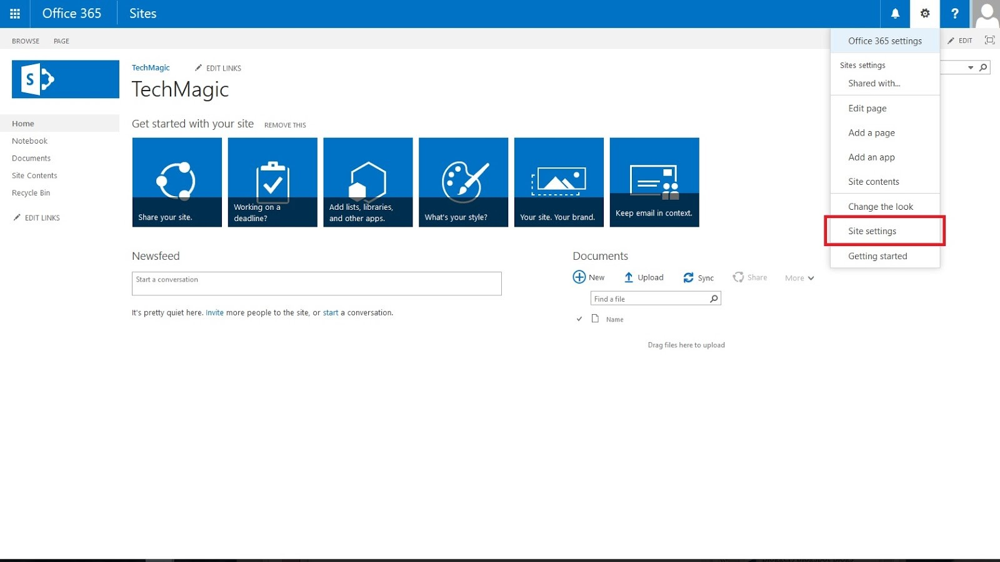

For this sample I am going to put a country property in my Site Collections. In our Content Type Hub Site go to our Site Settings

Once you're in the Site Settings Page find and select the "Site content types" under the "Web Designer Galleries"

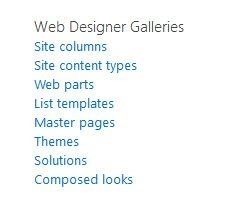

This will redirect to the page where all content type is created. Click on the Create to Start Creating our Content type.

Kindly put in the Name of the content type we wanted. For the "Select parent content type from" select "Document Content Type" and for the "Parent Content type" kindly select the "Basic Page".

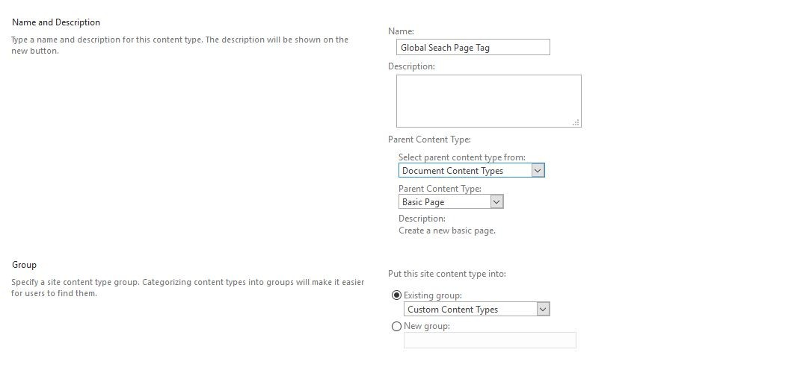

Click OK to save your changes. Once our Content type is created we may now start adding the Site Columns we wanted. Click on the "Add from new site column" link to start adding Site Columns to our Content type.

We will be a Site Columns in our Content type.

- Global Funding Source

This will be choice fields with the following choice

- Funding Source1

- Funding Source2

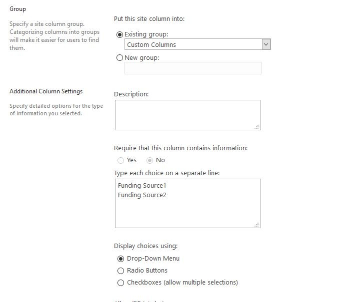

Click OK to save our Site Column. This will redirect you back to our newly created Content Type, for now we will save this content type to all our Site Collection. Click and select the "Manage publishing for this content type" link.

Once the page had loaded select the "Publish" and then hit save.

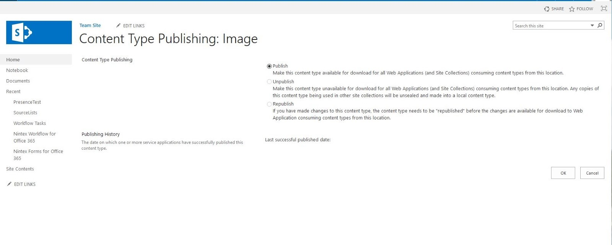

Wait for 10-30 minutes for the Content type to be cascaded to all our site collection(Defending of the number of Site Collection in our Farm).

Once we have verified that the Content Type we created from Part 1 is already reflecting to our Site Collection.

Go to Site Content then Search for the "Site Pages" or "Page" Library(Where your Default Page is stored).

In our Example my homepage is located in "SitePages" library

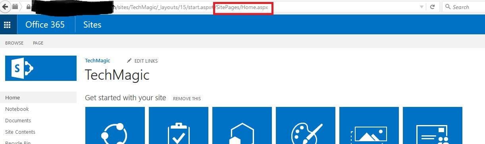

Once your in the Site Page Library, in the ribbon select on the Library > Library Settings

Under the Content type section select the "Add from existing site content types" link. This will give you all the available Content Type for our Library. Select the Content Type we have created earlier the "Global Seach Page Tag" Content type

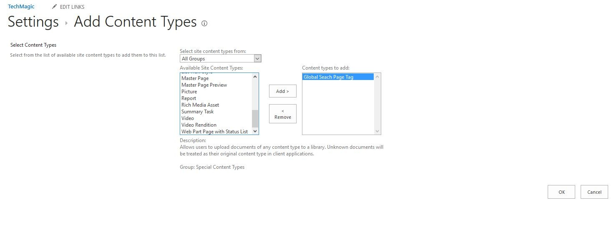

Hit OK to completely add our Content type to our Library. Now go back to our Site Page Library.

We now need add extra value for our Homepage(Home.aspx). We can do that showing in the default view the Site Columns we have added by going to the "Library> Modify View" in the Ribbon. Check or Enable the check box for our Column("Global Funding Source")

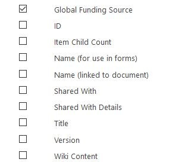

With this the Global Funding Source column should now be displaying our default view. Now we need to add value to it, on the ribbon select Library>Quick Edit.

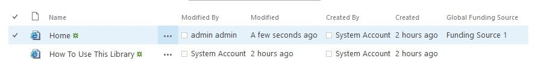

Again we need to wait for Search to pick up our settings(lets wait for 10-30 mins).

Now Lets go our Search center and add a new Search Page. I named the Page I created "Funding Source Page". Now in our new page click on the Edit Page

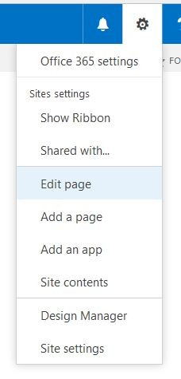

Now we will now modify our Search Result we can do that by editing the property of the "Search Results" Webpart. This will show the properties of the webpart. Click on the the "Change query" button.

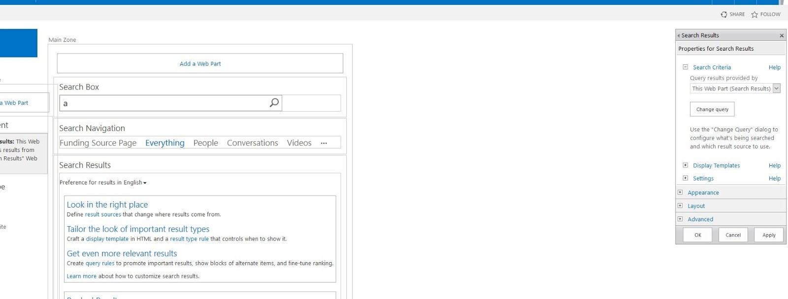

Click on the "Switch to Advance Mode" so that we could specify our own query. In the Query textbox type in the following query "{searchboxquery} contentclass:STS_Web contentclass:STS_site" then hit OK to apply our changes. The following query will limit the results to show Site Collection and Subsite only

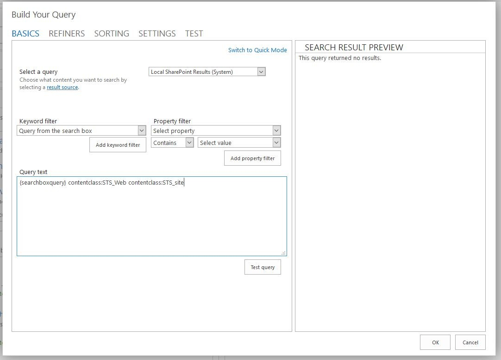

Click on Apply to save our changes to the page. Now we will now add our new Refiner. In the Refinement Webpart click Edit Webpart. Click on the "Choose Refiners" button. I mapped the column that we created earlier("Global Funding Source") the a refinablestring. Click here to view how I mapped the property.

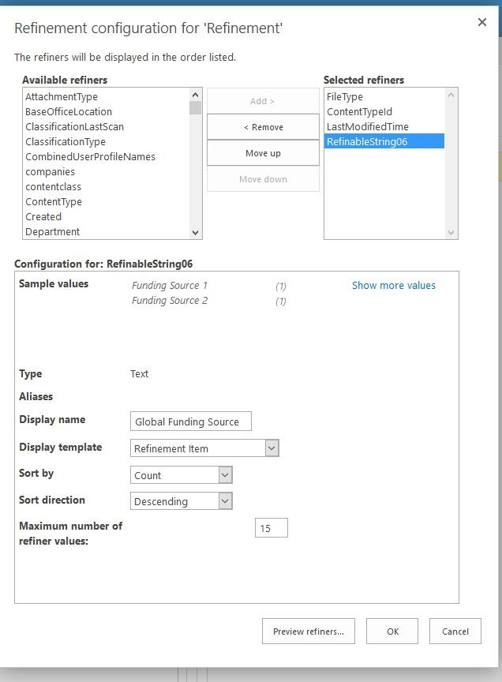

Now moving the RefinableString to the Selected refiner and giving it a DisplayName I was able to use it to refine the Site being shown in my Search Center. With this I can add property to my Site collection like Country or Department so that my User will have an easier experience in find a site collection they needed.(Dont forget to check in everything and publish)

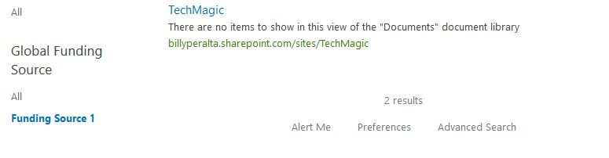

Now that should allow your users to refine a site based on the given choices. This would help them find the site/site collection they are looking for :)
