Let create first a SharePoint List as our source of choices in our dropdown

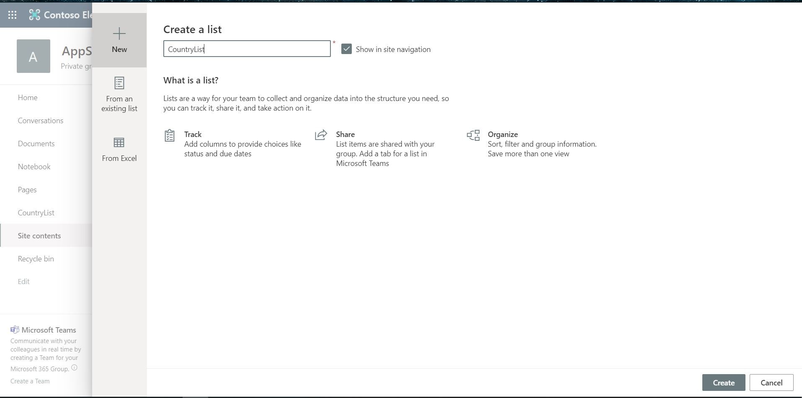

On the list(CountryList) that we created lets add a column and lets named it Continent(Single line of text)

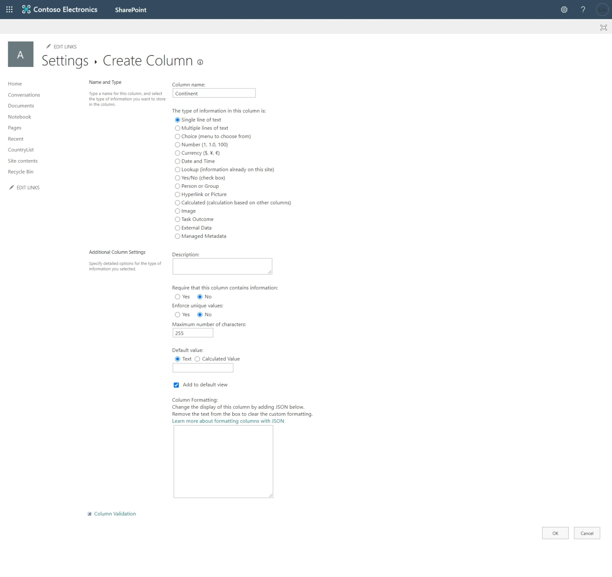

Lets try to populate it with different sets of data

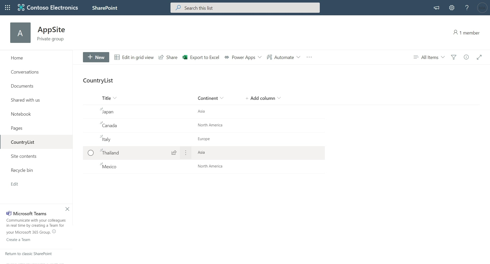

Now we will create a new list and lets call it our MainList

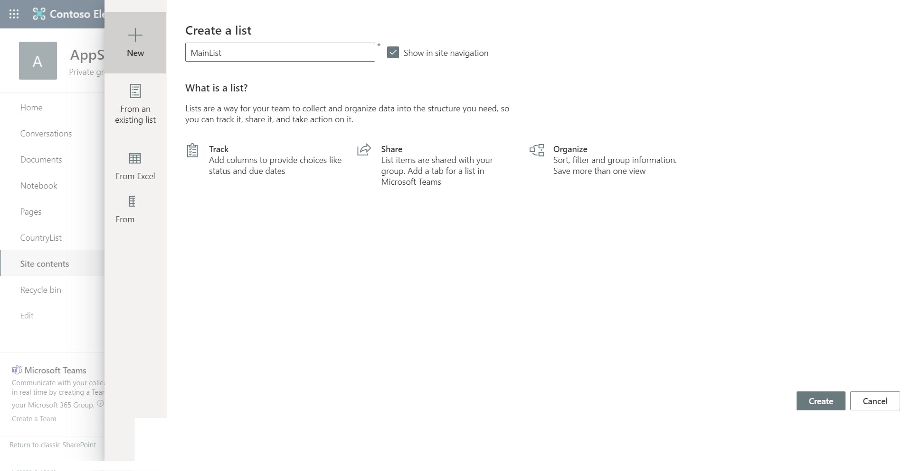

On the new list we created, that would be our list where we are going to store our user input. Now we will try to customized its form using PowerApps

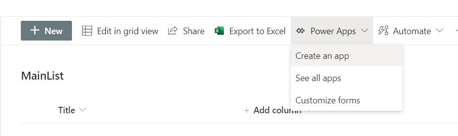

Lets call our form “CascadingDropdownForm” then press **Create**

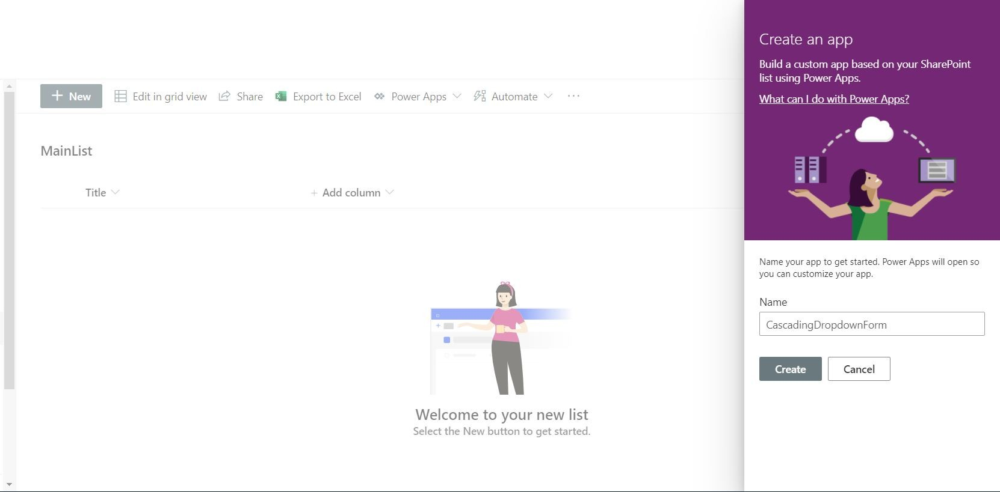

The apps shows no data because on our MainList, no item is added yet

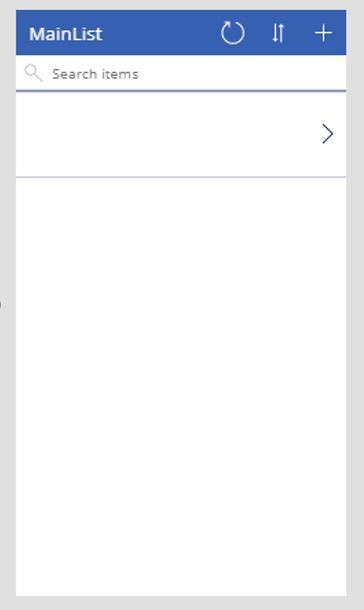

Let go to the EditScreen1

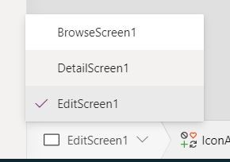

Now we will change the "Title" field from Single line of text to "Allowed Values" by click on the

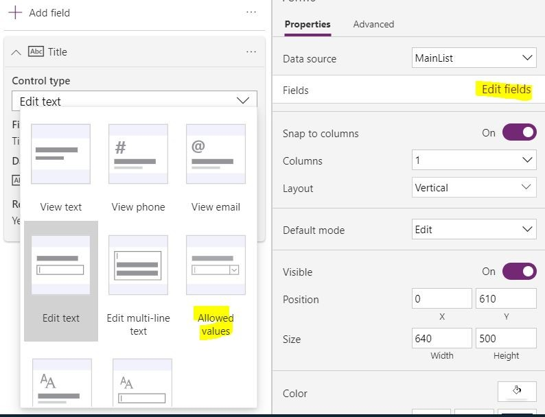

Now we need to unlock it by click on the "Title" dropdown and right click on and click on "unlock"

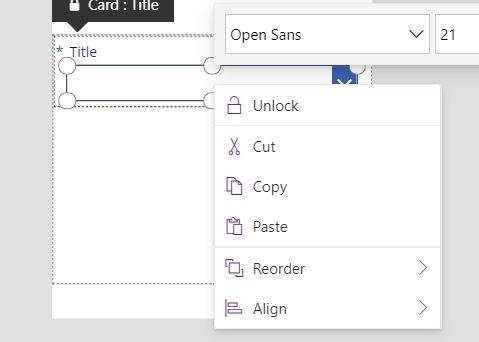

After that we will a connector in our App. This connector will point to our CountryList. To do that lets click on the “Data” > Connectors > SharePoint

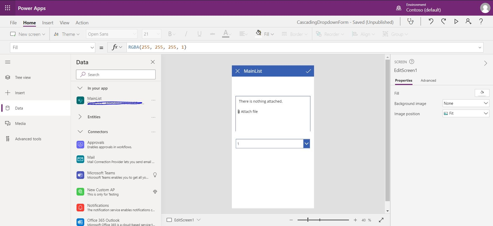

Enter the site url of your site and hit connect

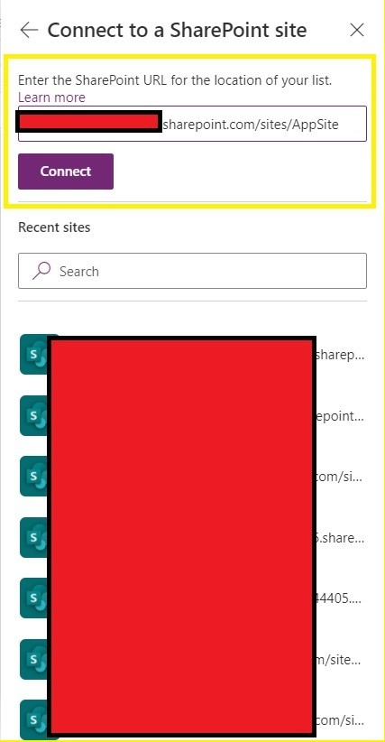

Kindly select our “CountryList” and then press Connect

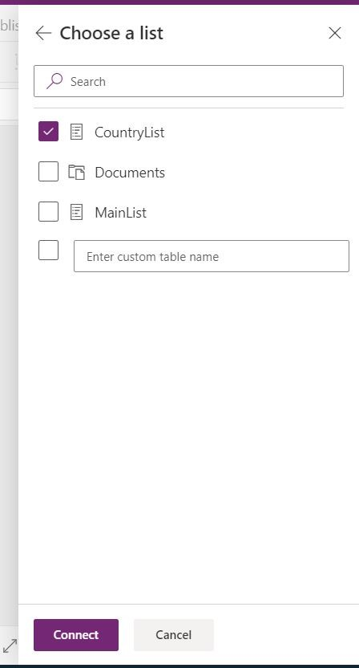

This should add a Connection under your “In your App” section

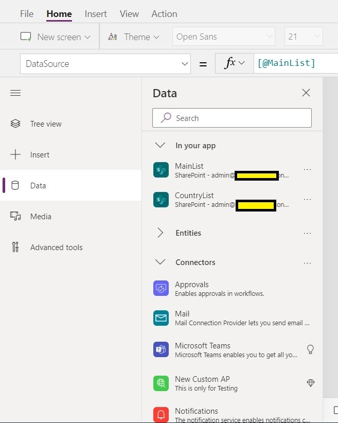

Now lets add the first dropdown in our canvas. We can do that by click on Insert > Dropdown. We are going to call it “DropContinent”

To bind our first dropdown to the appropriate data source we can do that by select the dropdown the select the property named “Items” then put “Distinct(CountryList, Continent)”. I use the “Distinct” function so that only unique values will be showing up in our DropContinent

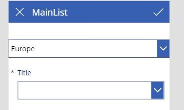

Once it is binded our first value should already be displaying

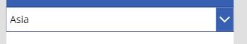

Now lets do the same thing to our Title Dropdown. But now we will have a different “Items” value to it. We will use the filter function. Select our second drodown select the “Items” property then type in “Filter(CountryList, Continent = DropContinent.Selected.Result)”

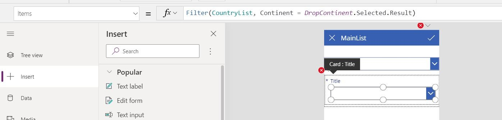

Note that it will error out so try click on "Edit in the Formula bar"

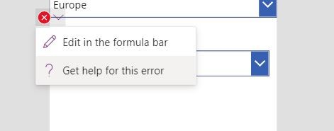

We should now update the "Update" property with "DataCardValue13.SelectedText.Value"

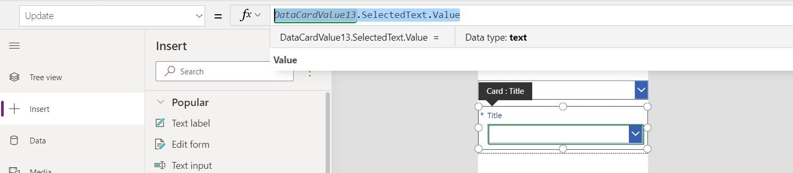

Let try it out in the Preview(Press F5). We select “North America” on our first dropdown and only choices that is under “North America” shows up.

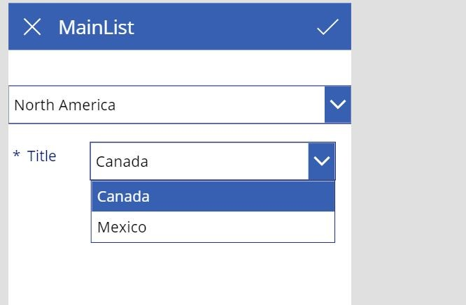

Lets now Publish our form and try it out
