## Requirements

- ReactJS

- react-aad-msal package (https://www.npmjs.com/package/react-aad-msal)

- axios package(Optional for testing out the API)

## Assumption

I assume you have basic knowledge of ReactJS, npm and you already got existing project.

## Setting everything up in Azure

First we need to setup everything in O365/Azure environment, we need to register our app to Azure so that we can access exclusively access Azure Resource/M365 outside Azure. In the Azure Portal search for “App Registration”

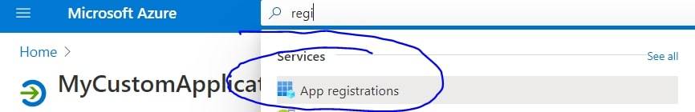

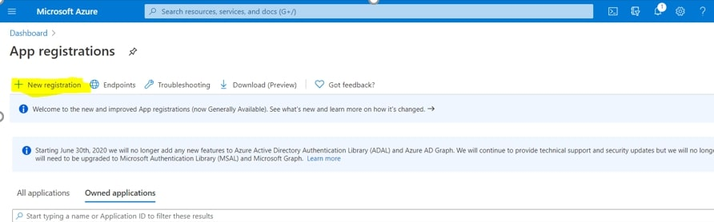

Fill in all information

- Name: MyCustomApplication
- Supported account types: Accounts in this organizational directory only (Contoso only - Single tenant)

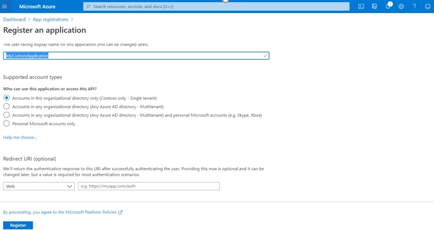

Once created please take not of the **Application (client) ID** and **Directory (tenant) ID**

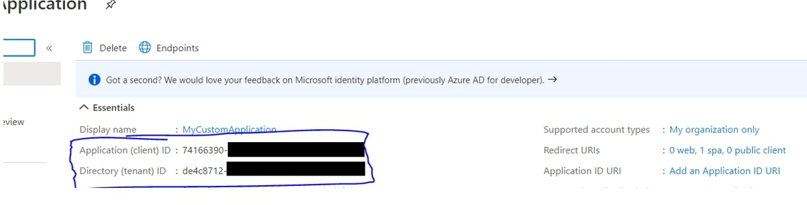

Once created and go to “API Permissions” then “Add a permission”

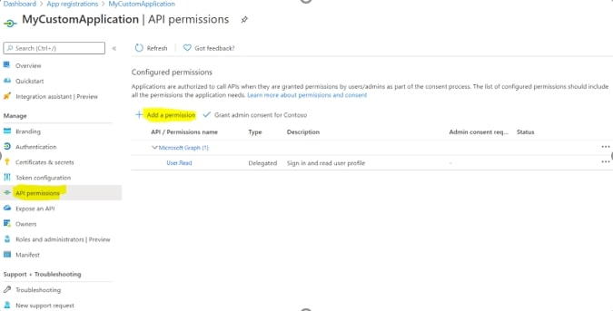

Select “SharePoint” then “Delegated permissions”.

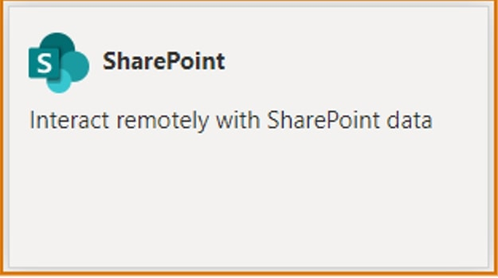

Select “AllSites.Read”

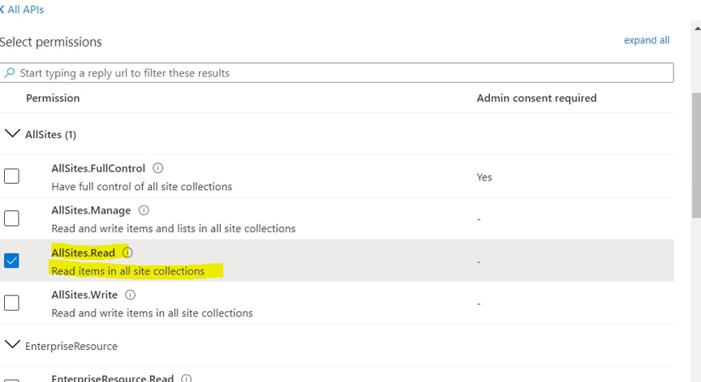

After that click on "Grant Admin consent"

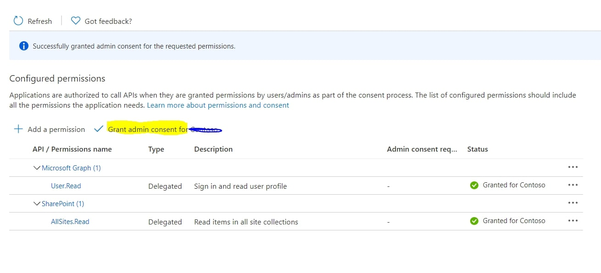

Now lets go to the “Authentication” then click “Add a platform”

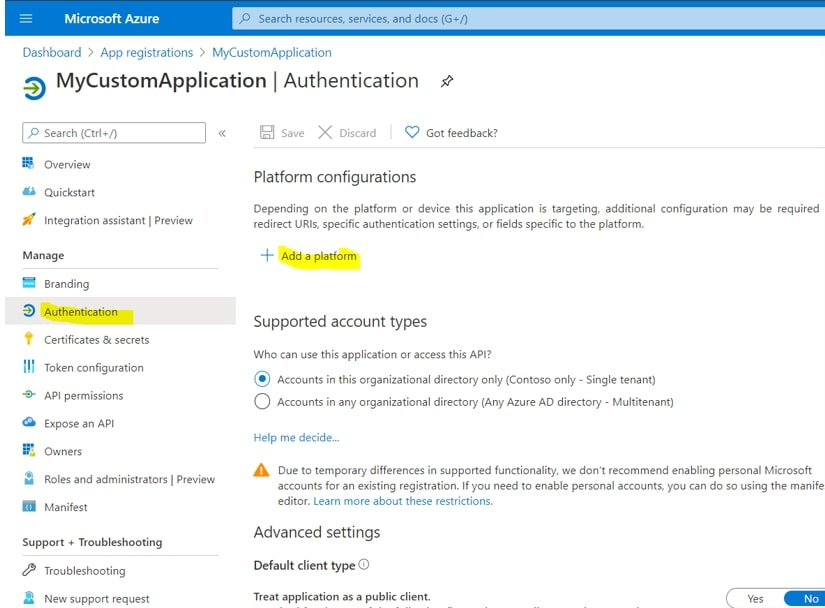

Click on “Single-page application” and fill the information with

- Redirect URI: https://localhost:3000/auth.html
- Logout URI: https://localhost:3000/

Then check “Access Token” and “ID Token” in the implicit grant

Add another URI by click in the “Add URI” then add https://localhost:3000/# then save

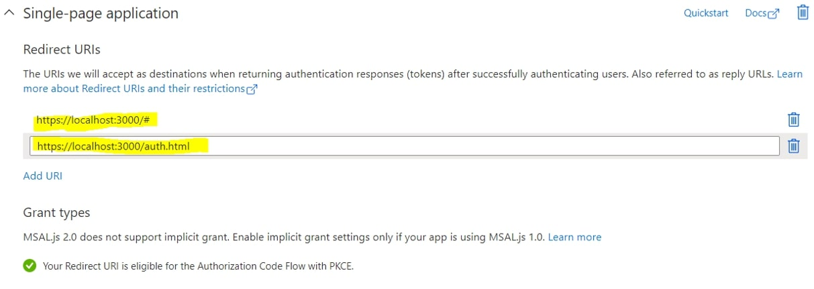

Done setting up in Azure, now lets move to coding :)

## Coding(ReactJS)

In your reactjs project install necessary packages

```js {numberLines}
npm i axios
npm i npm i react-aad-msal
```

Create a new file inside your src folder and name it “authProvider.js”. Please change the tenant ID and Client id based generated value from the app you created earlier.

```js {numberLines}
import { MsalAuthProvider, LoginType } from 'react-aad-msal';

import { Logger, LogLevel } from 'msal';

export const authProvider = new MsalAuthProvider(
  {
    auth: {
      authority: 'https://login.microsoftonline.com/[Enter Tenant ID]', //

      clientId: '[Enter Client ID]',

      postLogoutRedirectUri: 'https://localhost:3000/#',

      redirectUri: 'https://localhost:3000/#',

      validateAuthority: true,

      // After being redirected to the "redirectUri" page, should user

      // be redirected back to the Url where their login originated from?

      navigateToLoginRequestUrl: true,
    },

    // Enable logging of MSAL events for easier troubleshooting.

    // This should be disabled in production builds.

    system: {
      logger: new Logger(
        (logLevel, message, containsPii) => {
          console.log('[MSAL]', message);
        },

        {
          level: LogLevel.Verbose,

          piiLoggingEnabled: false,
        }
      ),
    },

    cache: {
      cacheLocation: 'localStorage',

      storeAuthStateInCookie: true,
    },
  },

  {
    scopes: ['AllSites.Read'],
  },

  {
    loginType: LoginType.Popup,

    // When a token is refreshed it will be done by loading a page in an iframe.

    // Rather than reloading the same page, we can point to an empty html file which will prevent

    // site resources from being loaded twice.

    tokenRefreshUri: window.location.origin + '/auth.html',
  }
);
```

Now create another file named “MainFile.jsx”. This would hold all the logic together.

```js {numberLines}
import React, { useState, useEffect } from 'react';

import { AzureAD, AuthenticationState } from 'react-aad-msal';

import axios from 'axios';

// Import the authentication provider which holds the default settings

import { authProvider } from './authProvider';

const MainFile = (props) => {
  const handleACToken = async () => {
    //Let get first our Access Token

    const token = await authProvider.getAccessToken();

    let farmUrl = '[ChangeYourOwnFarmUrl].sharepoint.com'; // Feel free to change this one with you FARM url

    let siteUrl = 'sites/DemoSiteForGraph'; //Note that this site collection should exists

    // Once we got it, we will as header when we call graph API that will show details of target site collection

    const request = await axios({
      method: 'GET',

      url: `https://graph.microsoft.com/v1.0/sites/${farmUrl}:/${siteUrl}?$select=id`,

      headers: {
        Accept: 'application/json',

        'content-Type': 'application/json',

        Authorization: `Bearer ${token.accessToken}`,
      },
    });

    alert(request.data.id);

    return request;
  };

  return (
    <div className="App">
      <header className="App-header">
        <h1 className="App-title">Welcome to the react-aad-msal sample</h1>
      </header>

      <AzureAD provider={authProvider}>
        {({ accountInfo, authenticationState, error, login }) => {
          return (
            <React.Fragment>
              {authenticationState === AuthenticationState.Unauthenticated && (
                <div>
                  <button className="Button" onClick={() => login()}>
                    Login
                  </button>{' '}
                </div>
              )}

              {authenticationState === AuthenticationState.InProgress && <div>Logging in</div>}

              {authenticationState === AuthenticationState.InProgress && <div>Logging in</div>}

              {authenticationState === AuthenticationState.Authenticated && (
                <div>
                  <button className="Button" onClick={() => handleACToken()}>
                    AC
                  </button>{' '}
                </div>
              )}

              <div className="SampleContainer">
                <div className="SampleBox">
                  <h2 className="SampleHeader">Authenticated Values</h2>

                  <p>When logged in, this box will show your tokens and user info</p>

                  {accountInfo && (
                    <div style={{ wordWrap: 'break-word' }}>
                      <p>
                        <span style={{ fontWeight: 'bold' }}>ID Token:</span> {accountInfo.jwtIdToken}
                      </p>

                      <p>
                        <span style={{ fontWeight: 'bold' }}>Username:</span> {accountInfo.account.userName}
                      </p>

                      <p>
                        <span style={{ fontWeight: 'bold' }}>Access Token:</span> {accountInfo.jwtAccessToken}
                      </p>

                      <p>
                        <span style={{ fontWeight: 'bold' }}>Name:</span> {accountInfo.account.name}
                      </p>
                    </div>
                  )}
                </div>

                <div className="SampleBox">
                  <h2 className="SampleHeader">Errors</h2>

                  <p>If authentication fails, this box will have the errors that occurred</p>

                  {error && (
                    <div style={{ wordWrap: 'break-word' }}>
                      <p>
                        <span style={{ fontWeight: 'bold' }}>errorCode:</span> {error.errorCode}
                      </p>

                      <p>
                        <span style={{ fontWeight: 'bold' }}>errorMessage:</span> {error.errorMessage}
                      </p>
                    </div>
                  )}
                </div>
              </div>
            </React.Fragment>
          );
        }}
      </AzureAD>
    </div>
  );
};
```

Now in our index.jsx we will call and use our “MainFile.jsx” component

```js {numberLines}
import React from 'react';

import MainFile from './MainFile;


const App = () => {

return < MainFile />;

};


export default App;
```

Now lets try to run our code

```js {numberLines}
npm start
```

Once the page loads try to click on the Login Button

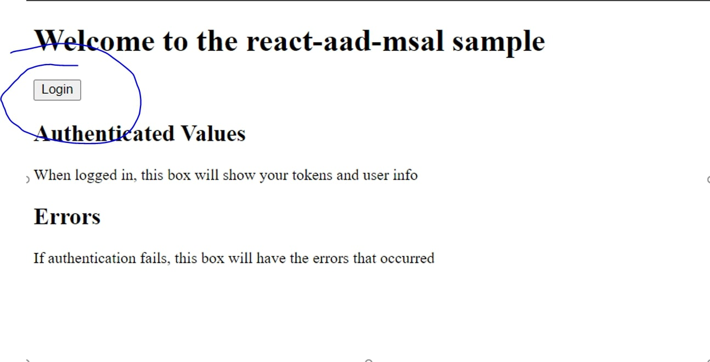

Once you are able to authenticate the another button should appear (with a level "AC") try click on it and should prompt up an alert and shows the target

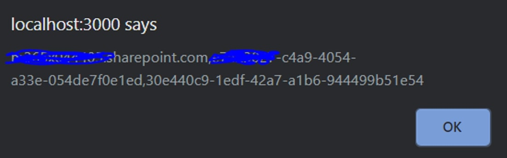

Once you get an alert it shows that you were able to get data from SharePoint
