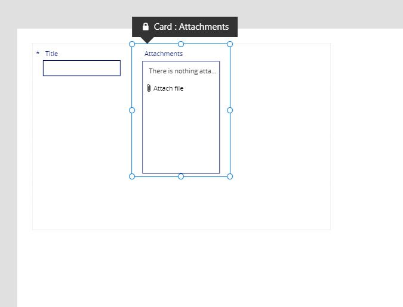
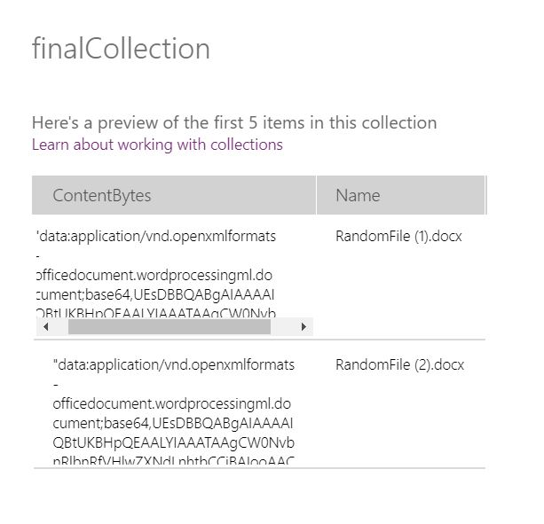

This Tutorial is about sending multiple attachment from Power Apps to Power Automate without attaching your Form to SharePoint

###Requirements

Before we can start we need the following:

- PowerApps
- PowerAutomate

###Adding Attachment Control(Skip if you already know how add Attachment control in your Form)

- First let go to https://make.powerapps.com/ then create a new Canvas App


1. On PowerApps there is no available control you can use for attachment. So what we need to do is lets connect our form to any SharePoint list.


Note: Feel free to connect to any site in your farm, it does not matter what list you'll use.


3. Once you are connect to a SharePoint list, go to you Screen and then select Inser > Forms > Edit


4. It will create a Form control, try to connect that new Form control to the Sharepoint List connection we did earlier



5. Now from here just copy(Ctrl + C) the attachment control inside the Form Control and Paste (Ctrl + V) it on your Screen


6. After Pasting you will now have an attachment control with errors on it(because its trying to find properties from its parent), with that just go to each error and try to delete the values that was initially given.


7. After resolving all error you should end up with Attachment control that is useful in your form

###Using now our Attachment Control and Passing the files to Power Automate


1. Its good that we have an attachment control(DataCardValue1) on our Form but unfortunately we cannot just use that and pass it on to Power Automate. We need to do a bunch of conversation to it before it would be useful.


2. Lets try to upload files in the Attacchment control(DataCardValue1) and using the code below I tried inserting the "Attachments" property of my Attachment control to a collection and I ended up with the following values:

Note that I added this code in my "OnSelect" of my submit button

```cmd
 "ClearCollect(attachmentControlColl,DataCardValue1.Attachments);"
```


- Name - This is the filename(obviously) of the files I uploaded in the control
- Value - Basically this string here is just a pointer in our memory, we really havent upload the files in Power Apps yet so its useless if we send collection directly to Power Automates.


2. Now that we have the file, in order it to become useful we need to trick the browser into uploading it somewhere not just in memory. We can do that by using a Gallery Control(Gallery1). And inside that Gallery we need to an Label control(FileNamePlaceholder) and an Image control(ImagePlaceholder)


2. Once its added I suggest making that Gallery Control(Gallery1) hidden. Because we really do not need to show this control to our user


2. Now remember earlier that we use the Submit button to fill up the values inside our collection called attachmentControlColl, we will not use that collection to populate our Gallery Control(Gallery1) and we can do that by changing the "Item" property of our Gallert to "attachmentControlColl"


2. Now that the Gallery Control(Gallery1) is now populated, we will assign the Label(FileNamePlaceholder) and Image(ImagePlaceholder) control inside our gallery to the different property of our Collection(attachmentControlColl). We can do that by editing the "Fields" Property.


```cmd
 "Clear(finalCollection);"
```

2. Now that the correct property are assigned to the correct control, we will now add more code in our Submit Button. First we need to create new collection, we can call it "finalCollection". Now since we load the files in our image, its no longer sitting in the memory of our browser. So our next step now is basically pulling it back to a new collection(finalCollection) so that we can send it to Power Automate.


```cmd
ForAll(
       Gallery1.AllItems,
       Collect(
               finalCollection,
               {
                 Name: FileNamePlaceholder.Text,
                  ContentBytes : JSON(ImagePlaceholder.Image,IncludeBinaryData)
               }
      )
);
```

2. After creating a new collection, we will now pull the data from our Gallery Control(Gallery1) and copy it to our new Collection(finalCollection)



2. After storing it on a collection, the output would be like this.

3. Note that this Collection(finalCollection) is still not yet ready to be send to Power Automate. What we need to do next is do some trimming on it so its on Base64

```
 ContentBytes : Mid(JSON(ImagePlaceholder.Image,IncludeBinaryData),Find(",",JSON(Image4.Image,IncludeBinaryData))+1, Len(JSON(Image4.Image,IncludeBinaryData))-Find(",",JSON(Image4.Image,IncludeBinaryData))-1)
```

3. So Basically your submit button should look like this


3. For now we are done with our PowerApps, we will now build our Power Automate

###Using now our Attachment Control and Passing the files to Power Automate

3. Create a blank PowerAutomate that will be triggered by PowerApps.

4. First is initialize an array variable


4. After that we need a "Parse JSON" action so that the Collection that will be coming from Power Apps could be use here in Power Automate


```
{
    "type": "array",
    "items": {
        "type": "object",
        "properties": {
            "Name": {
                "type": "string"
            },
            "ContentBytes": {
                "type": "string"
            }
        },
        "required": [
            "Name",
            "ContentBytes"
        ]
    }
}
```

4. After doing a Parse Json, we can now use in a loop and then using the "Convert" action, we will convert the "ContentBytes" property from Base64 to Binary using the following code


```
@{
base64ToBinary(items('Apply_to_each')['ContentBytes'])}
```

4. After doing convertion, we will now append this value to our array along with the filename


4. After your loop, you can use this array to attach it any you like. For me I would be using to in the "Send an email V2" action. Note: I only use Send email action to make things simple and showcase how to send attachment in your Power Automate.


4. Now that our Power Automate WF is complete, we need to go back to our Power Apps earlier and completing our submit button by adding the "run" function to pass the "finalCollection" to Power Automate


4. After hitting the submit button you should be able to receive an email with attachment on it.
