This tutorial shows on how to use PowerAutomate to get an image/scan file to a shared mailbox, extract necessary information inside the image file then upload all information to SharePoint. I believe this will help business remove their manual process of encoding hard coded information to SharePoint.

###Requirements

Before we can start we need the following:

- PowerAutomate - Access to "AI Builder" actions in Power Automate(O365 will give you 30days trial to try it out).  
- A service account which has access to a O365 Shared Mailbox.


###Ok Lets build our Library first

- First let start creating a Document Library(Name: ReceiptLibrary) in our target site, and add a single line column and name it "ControlIDColumn"

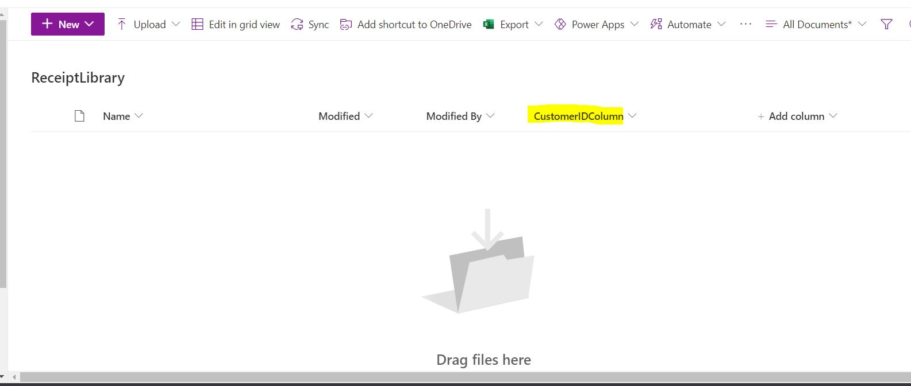

###Building our AI Model

1. Let move to Power Automate site and lets build our AI Model.

1. Under the AI Builder category, lets select "Build" then select "Form Processing"

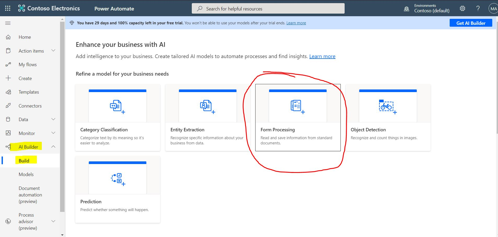

3. Give a name to our AI, I name it "ReceiptModel" so I know I will use it for our receipts. Hit Create

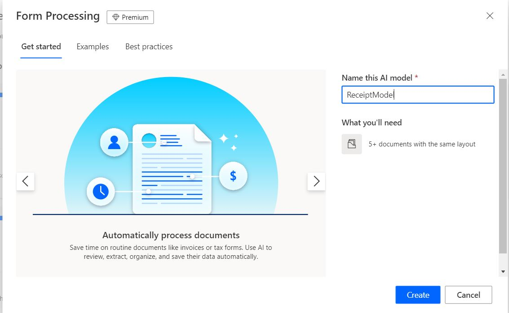

4. Enter in the "Field Name" for the information we wanted to extract, for our example we will extract the Custom ID]

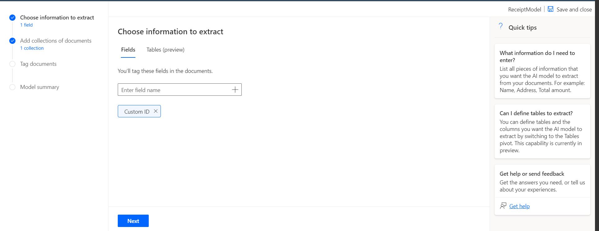

5. Now once we hit next it will ask us to create a Collection then upload (atleast) 5 sample of document we want to get data with. Note that sample document I have upload is a JPG image.


6. Next step is we need to teach the AI on where from the document we will extract the "Customer ID" from the 5 documents we have uploaded

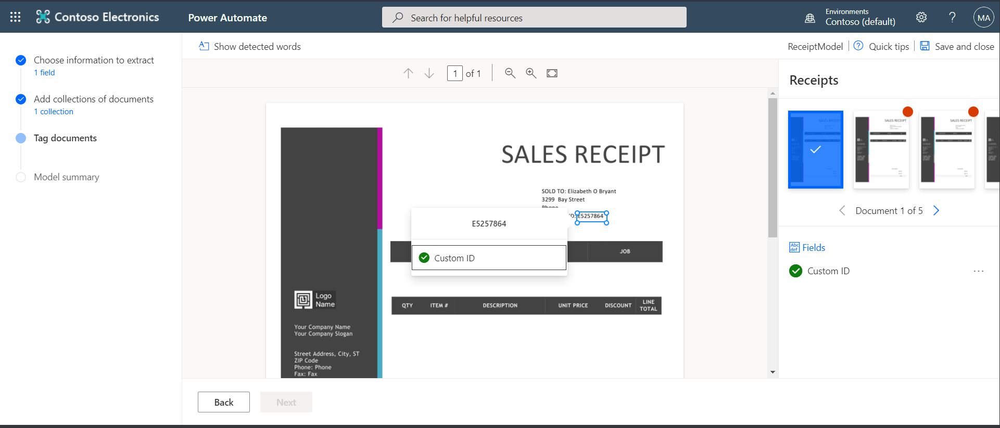

7. Hit Next then "Train"

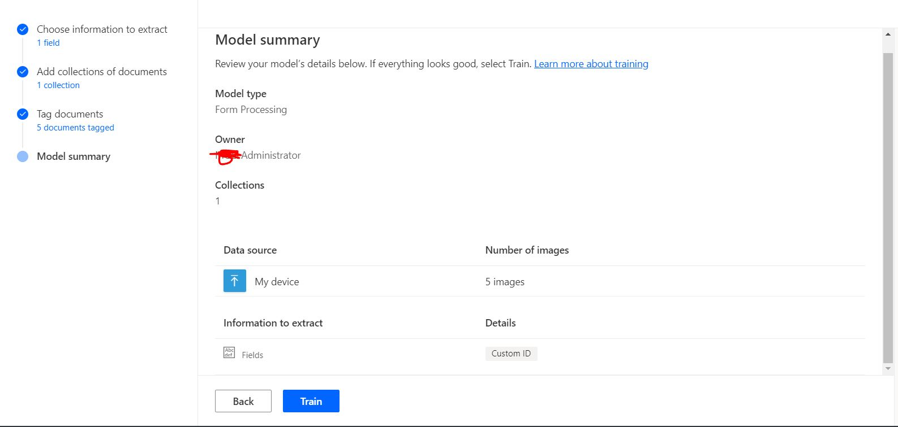

###Build our Power Automate

1. Let move to Power Automate site and lets create a "Automated Cloud Flow"


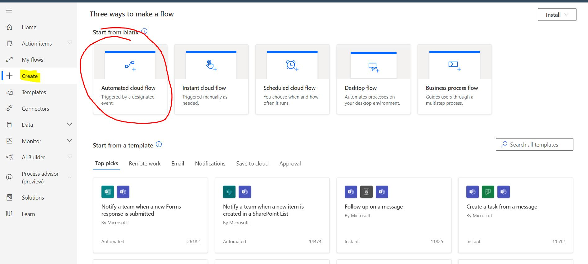

2. For its trigger we will use the "When a new email arrives in a shared mailbox(V2)" trigger, then hit create


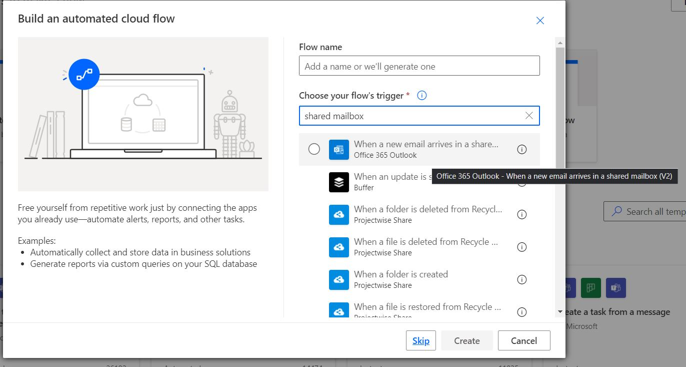

Note: You need to make sure that "Only with Attachments" and "Include Attachments" is set to Yes 

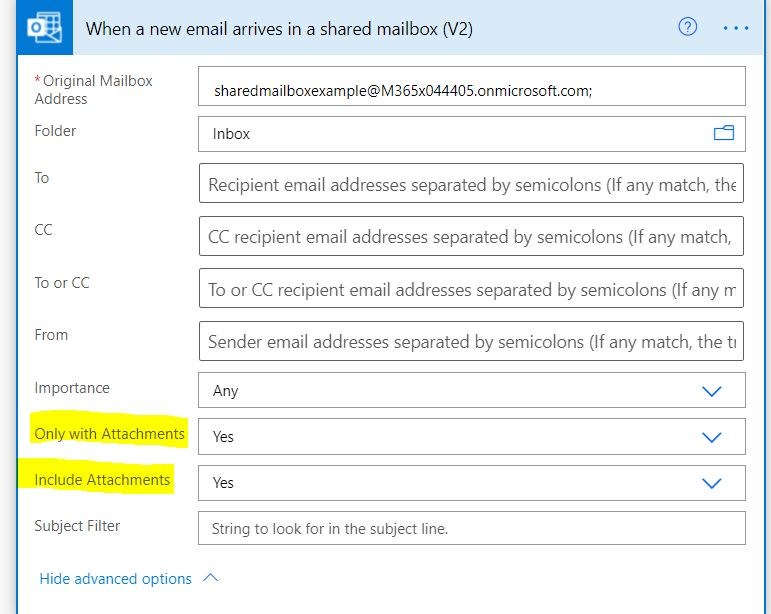

If you didnt set it to yes, you will encounter the error below
```

{"operationStatus":"Error","error":{"type":"Error","code":"InvalidPredictionInput","message":"The base 64 binary content is missing for input single","properties":{"BackendErrorCode":"InvalidInferenceInput","DependencyHttpStatusCode":"400"},"innerErrors":[{"scope":"Record","target":"single","code":"InvalidRecord","type":"Error","properties":{"MlIssueCode":"InvalidRecord","MlIssueTarget":"single"}}]}}

```


3. Enter in the email address of the shared mailbox you want to use 

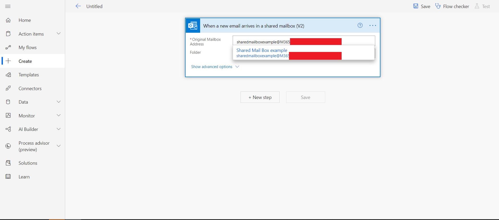

4. Once the trigger is added, we will now add an action called "Process and save information from forms" to get the content we need from the attached files of the email we received.

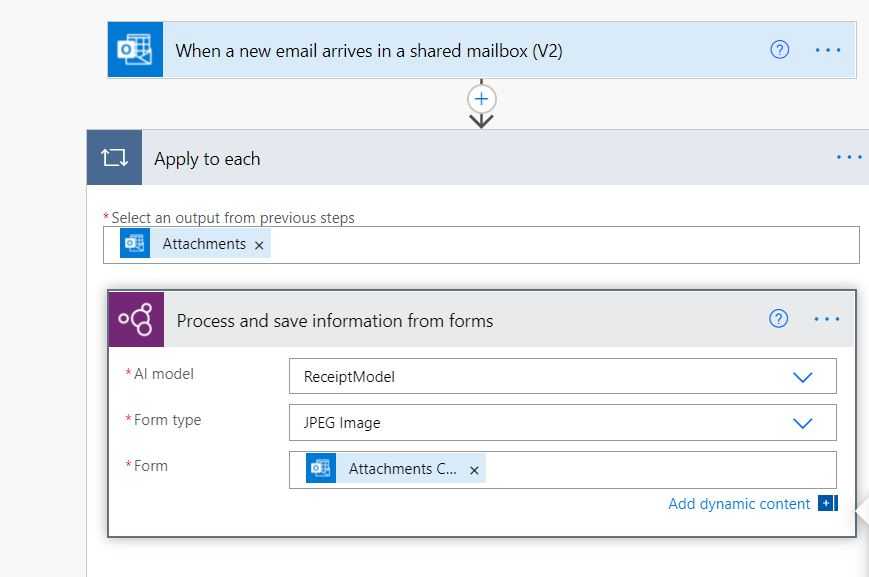

5. Once we extract we will need upload it to SharePoint along with the Control ID from the attached file. First lets add an action that will upload the attached file to SharePoint, we can do that by adding the "Create file" action

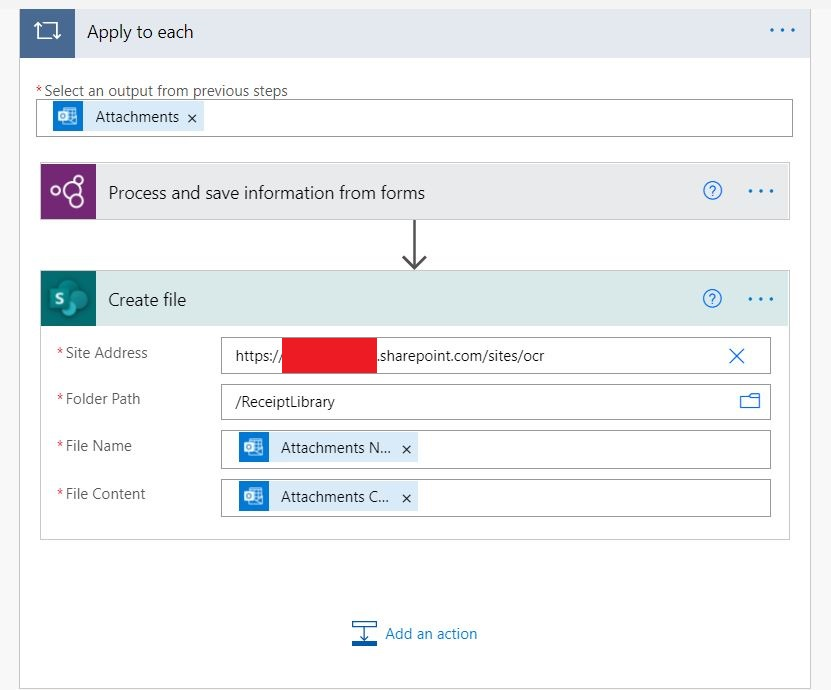


6. After uploading, we will now fill up the "CustomerIDColumn" of the file we upload using the value we extract from our image. We will add the "Update file properties" and the "Custom ID value" property to fill up our target column

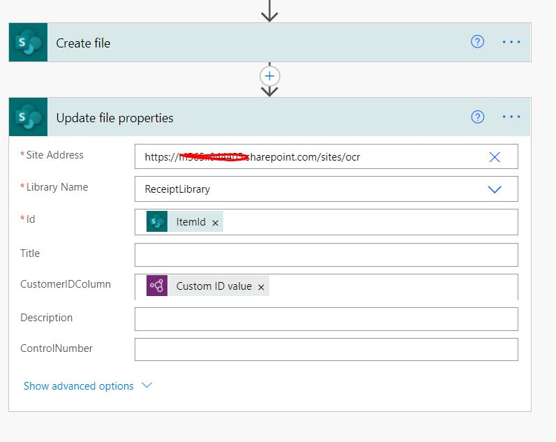

```cmd
Id: @{outputs('Create_file')?['body/ItemId']}
CustomerIDColumn: @{outputs('Process_and_save_information_from_forms')?['body/responsev2/predictionOutput/labels/Custom_07396f100afdf55ca21cf1fff1e0ed2ac/value']}
```

7. Save our changes and time for testing

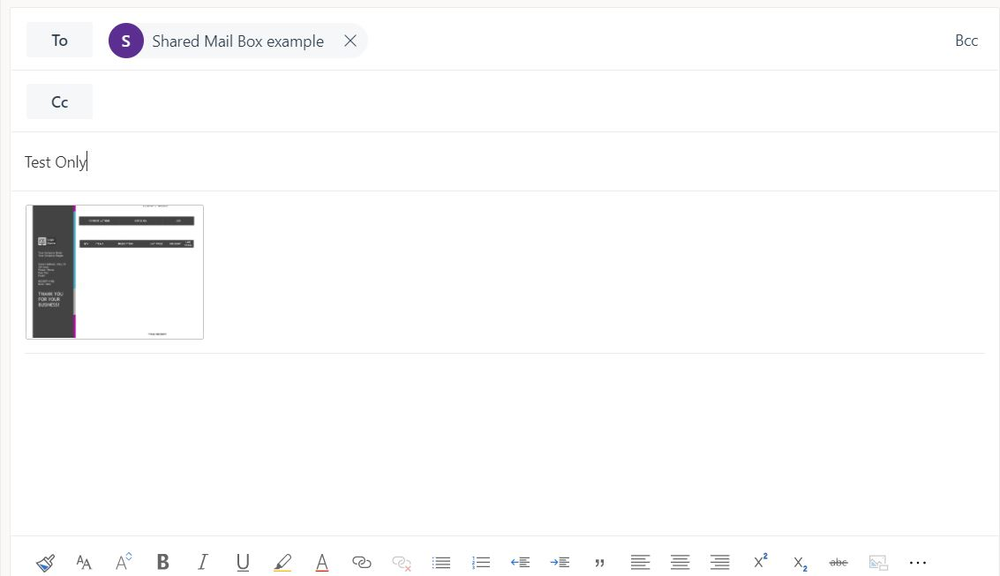

8. In my email I attached the image file below

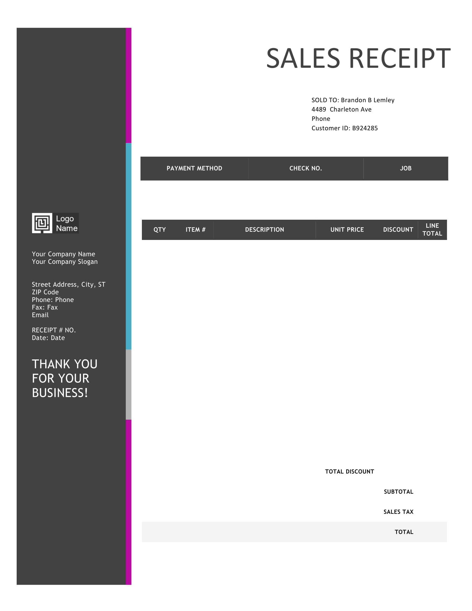


9. After few seconds, the file that I attached is now uploaded to our Document Library with the CustomIDColumn filled up

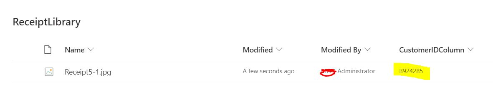


###Things we can add to improve this process

- We can extract all the information we need so that there is no longer a need to manually input data to SharePoint
- Once an email is process we can move it out from the "Inbox" and to a "Processed" folder so we wont clog down the Inbox folder, and if there is an error as well we can move the email to a "Error" folder inside the Shared Mailbox.
- We can also extract as well the "Custom ID confidence score" from our "Process and save information from forms" action and then save it to the meta data of the file, so that we know how accurate the data we got from our Workflow