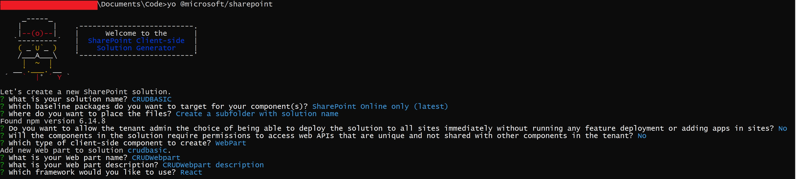

###Requirements

Before we start the following technology are installed in my development machine and its corresponding version

1. [NodeJS v10.23](https://nodejs.org/en/) - Currently v10.x.x is the recommended version of NodeJS for SPFx.
1. [NPM any latest version would work](https://www.npmjs.com/)
1. [Ready your favorite IDE, mine is Visual Studio Code](https://code.visualstudio.com/)
1. [Yeoman Generator 3.1.1](https://yeoman.io/)
1. [Gulp 3.1.1](https://gulpjs.com/)
1. Of course you will need your O365 tenant with SharePoint Online to work with.

###Ok Lets start...

1. Once everything in our environemnt is ready we can now start generating our SPfx.
   We can start by using Yeoman. Open your command prompt and type the following

```cmd
yo @microsoft/sharepoint
```

2. It will ask you the following information


