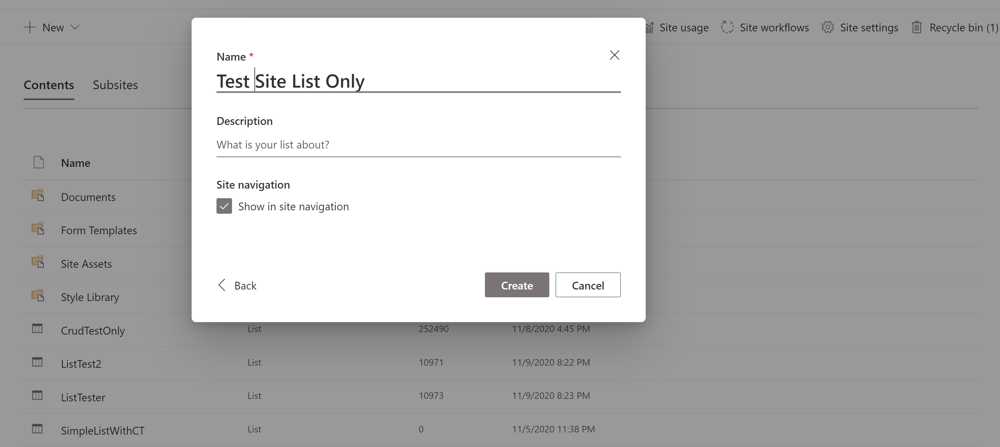
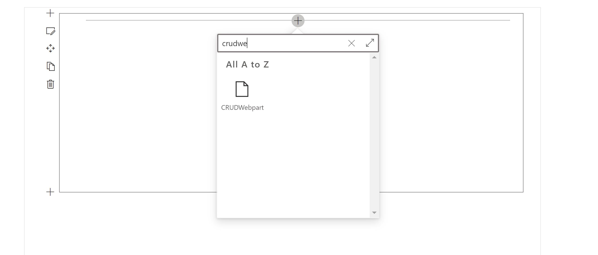
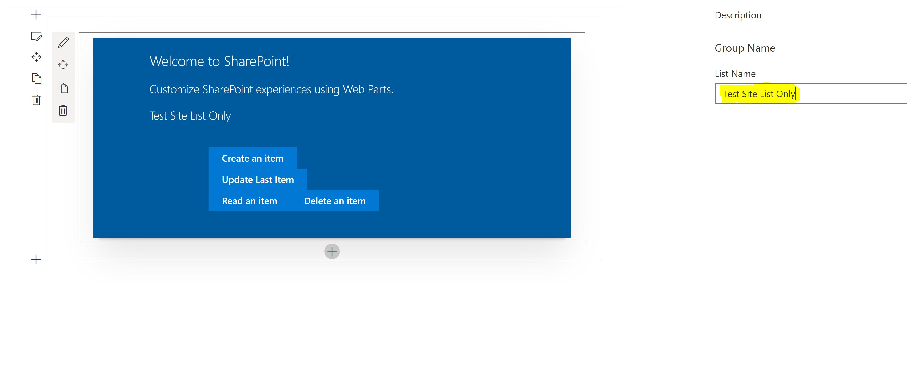

###Requirements

Before we start the following technology are installed in my development machine and its corresponding version

1. [NodeJS v10.23](https://nodejs.org/en/) Currently v10.x.x is the recommended version of NodeJS for SPFx.
1. [NPM any latest version would work](https://www.npmjs.com/)
1. [Ready your favorite IDE, mine is Visual Studio Code](https://code.visualstudio.com/)
1. [Yeoman Generator 3.1.1](https://yeoman.io/)
1. [Gulp 3.1.1](https://gulpjs.com/)
1. Of course you will need your O365 tenant with SharePoint Online to work with.

###Ok Lets start...

1. Once everything in our environemnt is ready we can now start generating our SPfx.
   We can start by using Yeoman. Open your command prompt and type the following

```cmd
yo @microsoft/sharepoint
```

2. It will ask you the following information


> What is your solution name? **_CRUDBASIC_**

> Which baseline packages do you want to target for your component(s)? **_SharePoint Online only (latest)_**

> Where do you want to place the files? **_Create a subfolder with solution name_**

> Do you want to allow the tenant admin the choice of being able to deploy the solution to all sites immediately without running any feature deployment or adding apps in sites? **_No_**

> Will the components in the solution require permissions to access web APIs that are unique and not shared with other components in the tenant? **_No_**

> Which type of clientside component to create? **_WebPart_**

> What is your Web part name? **_CRUDWebpart_**

> What is your Web part description? **_CRUDWebpart description_**

> Which framework would you like to use? **_React_**

3. Try to open the **_"CRUDBASIC"_** folder in your Visual Studio Code

4. Lets now try to install the PnPjs in our project, so in Visual Studio lets run the follow

```cmd
npm install @pnp/common @pnp/logging @pnp/odata @pnp/sp
```

5. Edit "src\webparts\crudReact\loc\en-us.js" file.

```js {numberLines}
define([], function() {
  return {
    "PropertyPaneDescription": "Description",
    "BasicGroupName": "Group Name",
    "DescriptionFieldLabel": "Description Field",
    ***"ListNameFieldLabel": "List Name" ***
  }
});

```

6. Edit "src\webparts\crudReact\loc\mystrings.d.ts" file

```js {numberLines}
declare interface ICrudWebpartWebPartStrings {
  PropertyPaneDescription: string;
  BasicGroupName: string;
  DescriptionFieldLabel: string;
  ***ListNameFieldLabel:string;***
}

declare module 'CrudWebpartWebPartStrings' {
  const strings: ICrudWebpartWebPartStrings;
  export = strings;
}
```

7. Now lets edit the "src\webparts\crudWebpart\CrudWebpartWebPart.ts" file. I did the following changes

   - Line #3 - I added a reference to the PnPJs librar because we will be be adding the site conext to our whole application
   - Line #16 - We added a new property to "ICrudWebpartWebPartProps" called "listName"
   - Line #1266 - We also added the "listName" property in the props that we are sending to our "CrudWebpart" so that it will be available for consumption.
   - Line #37 - [We commmented out "dataVersion" since its only compabtible to old version of TypeScript](https://dreamsof.dev/2020-09-21-typescript-upgrade-breaking-dataversion-get-override-spfx11/)
   - Line #62 - We also the commented out the property 'description' since we will no longer be using it
   - Line #65 - We added a new property called "listName" becase we will be using it to identify what list our targeting. So its not hard coded to our application

```js {numberLines}
import * as React from "react";
import * as ReactDom from "react-dom";
import { sp } from "@pnp/sp";
import { Version } from "@microsoft/sp-core-library";
import {
  IPropertyPaneConfiguration,
  PropertyPaneTextField,
} from "@microsoft/sp-property-pane";
import { BaseClientSideWebPart } from "@microsoft/sp-webpart-base";

import * as strings from "CrudWebpartWebPartStrings";
import CrudWebpart from "./components/CrudWebpart";
import { ICrudWebpartProps } from "./components/ICrudWebpartProps";

export interface ICrudWebpartWebPartProps {
  listName: string;
}

export default class CrudWebpartWebPart extends BaseClientSideWebPart<
  ICrudWebpartWebPartProps
> {
  public render(): void {
    const element: React.ReactElement<ICrudWebpartProps> = React.createElement(
      CrudWebpart,
      {
        listName: this.properties.listName,
      }
    );

    ReactDom.render(element, this.domElement);
  }

  protected onDispose(): void {
    ReactDom.unmountComponentAtNode(this.domElement);
  }

  // protected get dataVersion(): Version {
  //   return Version.parse('1.0');
  // }

  public onInit(): Promise<void> {
    return super.onInit().then((_) => {
      // other init code may be present

      sp.setup({
        spfxContext: this.context,
      });
    });
  }

  protected getPropertyPaneConfiguration(): IPropertyPaneConfiguration {
    return {
      pages: [
        {
          header: {
            description: strings.PropertyPaneDescription,
          },
          groups: [
            {
              groupName: strings.BasicGroupName,
              groupFields: [
                // PropertyPaneTextField('description', {
                //   label: strings.DescriptionFieldLabel
                // }),
                PropertyPaneTextField("listName", {
                  //label: strings.DescriptionFieldLabel
                  label: strings.ListNameFieldLabel,
                }),
              ],
            },
          ],
        },
      ],
    };
  }
}

```

8. Lets now open "src\webparts\crudWebpart\components\ICrudWebpartProps.ts" file and apply the following changes.

```js
export interface ICrudWebpartProps {
  // description: string;
  listName: string;
}
```

9. We will now create a new folder called "services" under the "crudWebPart" folder. We will also a new ts file called "MainListApi.ts", with the the relative path should be "src\webparts\crudWebpart\services\MainListApi.ts"

1. To make it more organize we will use "MainListApi.ts" to store all service we use for doing CRUD operation to our List. Now lets open the new file that we created and add the following code:

```js {numberLines}
import { sp } from '@pnp/sp';
import '@pnp/sp/webs';
import '@pnp/sp/lists';
import '@pnp/sp/items';
import { IItemAddResult, IItems } from '@pnp/sp/items';

const AddListItem = async (ListName: string): Promise<void> => {
  const iar: IItemAddResult = await sp.web.lists.getByTitle(ListName).items.add({
    Title: 'OldValueIsHere',
  });
};

const UpdateListItem = async (ListName: string): Promise<void> => {
  const lastItem: IItems = await sp.web.lists
    .getByTitle(ListName)
    .items.select('Title, ID')
    .top(1)
    .orderBy('Modified', true)
    .get();

  await sp.web.lists.getByTitle(ListName).items.getById(lastItem[0].ID).update({
    Title: 'My New Title',
  });
};

const DeleteListItem = async (ListName: string): Promise<void> => {
  const lastItem: IItems = await sp.web.lists
    .getByTitle(ListName)
    .items.select('Title, ID')
    .top(1)
    .orderBy('Modified', true)
    .get();

  await sp.web.lists.getByTitle(ListName).items.getById(lastItem[0].ID).recycle();
};

const ReadListItem = async (ListName: string): Promise<string> => {
  const lastItem: IItems = await sp.web.lists
    .getByTitle(ListName)
    .items.select('Title, ID')
    .top(1)
    .orderBy('Modified', true)
    .get();

  alert(lastItem[0].Title);
  return lastItem[0].Title;
};

export { AddListItem, UpdateListItem, DeleteListItem, ReadListItem };
```

11. Now lets open our "src\webparts\crudWebpart\components\CrudWebpart.tsx" file and lets add the following code

    - Line #5 - We reference the file(MainListApi.ts) we created earlier so that we can use the service and use it to do changes in our lists.

    - Line #30 - We added buttons that when click different function in our service file.

```js {numberLines}
import * as React from "react";
import styles from "./CrudWebpart.module.scss";
import { ICrudWebpartProps } from "./ICrudWebpartProps";
import { escape } from "@microsoft/sp-lodash-subset";
import {
  UpdateListItem,
  AddListItem,
  DeleteListItem,
  ReadListItem,
} from "../services/MainListApi";

export default class CrudWebpart extends React.Component<
  ICrudWebpartProps,
  {}
> {
  public render(): React.ReactElement<ICrudWebpartProps> {
    return (
      <div className={styles.crudWebpart}>
        <div className={styles.container}>
          <div className={styles.row}>
            <div className={styles.column}>
              <span className={styles.title}>Welcome to SharePoint!</span>
              <p className={styles.subTitle}>
                Customize SharePoint experiences using Web Parts.
              </p>
              <p className={styles.description}>
                {escape(this.props.listName)}
              </p>

              <div className={`ms-Grid-row ms-fontColor-white ${styles.row}`}>
                <div className="ms-Grid-col ms-u-lg10 ms-u-xl8 ms-u-xlPush2 ms-u-lgPush1">
                  <a
                    href="#"
                    className={`${styles.button}`}
                    onClick={() => AddListItem(this.props.listName)}
                  >
                    <span className={styles.label}>Create an item</span>
                  </a>
                  <a
                    href="#"
                    className={`${styles.button}`}
                    onClick={() => UpdateListItem(this.props.listName)}
                  >
                    <span className={styles.label}>Update Last Item</span>
                  </a>
                  <a
                    href="#"
                    className={`${styles.button}`}
                    onClick={() => ReadListItem(this.props.listName)}
                  >
                    <span className={styles.label}>Read an item</span>
                  </a>
                  <a
                    href="#"
                    className={`${styles.button}`}
                    onClick={() => DeleteListItem(this.props.listName)}
                  >
                    <span className={styles.label}>Delete an item</span>
                  </a>
                </div>
              </div>
            </div>
          </div>
        </div>
      </div>
    );
  }
}

```

12. We are now done with the changes in our code, now we will now try our SPFx to our O365 Site collection.

13. Run the following code in your terminal

```cmd
gulp serve
```

14. Now lets go to your development Site Collection and create a test list(name it "Test Site List Only") we can try it out



15. Once created, we will not try the webpart in our site collection through our workbench. You can go to the workbench through this url

`https://[MyO365Url]/sites/[SubSite]/_layouts/15/workbench.aspx`

16. Now Lets try to deploy it, by searching the "CRUDWebPart"



17. Now lets open the workflow property pane and add the name we created earlier in the "Test Site List Only" property



18. Now lets now try click on the buttons
