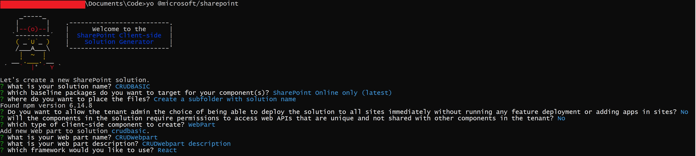

###Requirements

Before we start the following technology are installed in my development machine and its corresponding version

1. [NodeJS v10.23](https://nodejs.org/en/) Currently v10.x.x is the recommended version of NodeJS for SPFx.
1. [NPM any latest version would work](https://www.npmjs.com/)
1. [Ready your favorite IDE, mine is Visual Studio Code](https://code.visualstudio.com/)
1. [Yeoman Generator 3.1.1](https://yeoman.io/)
1. [Gulp 3.1.1](https://gulpjs.com/)
1. Of course you will need your O365 tenant with SharePoint Online to work with.

###Ok Lets start...

1. Once everything in our environemnt is ready we can now start generating our SPfx.
   We can start by using Yeoman. Open your command prompt and type the following

```cmd
yo @microsoft/sharepoint
```

2. It will ask you the following information



> What is your solution name? **_GRAPHAPIBASIC_**

> Which baseline packages do you want to target for your component(s)? **_SharePoint Online only (latest)_**

> Where do you want to place the files? **_Create a subfolder with solution name_**

> Do you want to allow the tenant admin the choice of being able to deploy the solution to all sites immediately without running any feature deployment or adding apps in sites? **_No_**

> Will the components in the solution require permissions to access web APIs that are unique and not shared with other components in the tenant? **_Yes_**

> Which type of clientside component to create? **_WebPart_**

> What is your Web part name? **_GRAPHWebpart_**

> What is your Web part description? **_GRAPHWebpart description_**

> Which framework would you like to use? **_React_**

3. Try to open the **_"GRAPHAPIBASIC"_** folder in your Visual Studio Code

4. We will now install "microsoft-graph-types" in our solution.

```cmd
npm install @microsoft/microsoft-graph-types --save-dev
```

5. Open "GraphWebpartWebPart.ts" (src\webparts\graphWebpart\GraphWebpartWebPart.ts) because we will be adding the following

   - Line #14 - Adding the context that we will be pass as a props to our webpart.
   - Line #18 - Added the WebPartContext.
   - Line #28 - Passing the WebpartContext as a props.

```js {numberLines}
import * as React from 'react';
import * as ReactDom from 'react-dom';
import { Version } from '@microsoft/sp-core-library';
import {
  IPropertyPaneConfiguration,
  PropertyPaneTextField
} from '@microsoft/sp-property-pane';
import { BaseClientSideWebPart } from '@microsoft/sp-webpart-base';

import * as strings from 'GraphWebpartWebPartStrings';
import GraphWebpart from './components/GraphWebpart';
import { IGraphWebpartProps } from './components/IGraphWebpartProps';

import { WebPartContext } from '@microsoft/sp-webpart-base';  //

export interface IGraphWebpartWebPartProps {
  description: string;
  context: WebPartContext;  //
}

export default class GraphWebpartWebPart extends BaseClientSideWebPart<IGraphWebpartWebPartProps> {

  public render(): void {
    const element: React.ReactElement<IGraphWebpartProps> = React.createElement(
      GraphWebpart,
      {
        description: this.properties.description,
        context: this.context
      }
    );

    ReactDom.render(element, this.domElement);
  }


  protected onDispose(): void {
    ReactDom.unmountComponentAtNode(this.domElement);
  }

  protected get dataVersion(): Version {
    return Version.parse('1.0');
  }

  protected getPropertyPaneConfiguration(): IPropertyPaneConfiguration {
    return {
      pages: [
        {
          header: {
            description: strings.PropertyPaneDescription
          },
          groups: [
            {
              groupName: strings.BasicGroupName,
              groupFields: [
                PropertyPaneTextField('description', {
                  label: strings.DescriptionFieldLabel
                })
              ]
            }
          ]
        }
      ]
    };
  }
}
```

6. Now we will open the interface for our webpart, open "IGraphWebpartProps.ts" (src\webparts\graphWebpart\components\IGraphWebpartProps.ts) and add the following:

```js
import { WebPartContext } from '@microsoft/sp-webpart-base'; //

export interface IGraphWebpartProps {
  description: string;
  context: WebPartContext;
}
```

7. We will now create a new folder called "services" under the "graphWebpart" folder. We will also a new ts file called "GraphApi.ts", with the the relative path should be "src\webparts\graphWebpart\services\GraphApi.ts"

```js
import { MSGraphClient } from '@microsoft/sp-http';
import { WebPartContext } from '@microsoft/sp-webpart-base'; //

const AccessGraphApi = async (graphContext: WebPartContext): Promise<any> => {
  graphContext.msGraphClientFactory.getClient().then(async (client: MSGraphClient) => {
    const client2 = await client.api('/me/messages').select('subject').get();

    console.log('client2', client2);
  });
};

export { AccessGraphApi };
```

8. Now our service is now complete, we will be using it in a button in our webpart. Kindly open GraphWebpart.tsx ("src\webparts\graphWebpart\components\GraphWebpart.tsx") and add the following:

   - Line #5 - Adding service we created earlier.
   - Line #20-#31 - Adding a button that when press will going to access the API

```js {numberLines}
import * as React from 'react';
import styles from './GraphWebpart.module.scss';
import { IGraphWebpartProps } from './IGraphWebpartProps';
import { escape } from '@microsoft/sp-lodash-subset';
import { AccessGraphApi } from "../services/GraphApi"

export default class GraphWebpart extends React.Component<IGraphWebpartProps, {}> {
  public render(): React.ReactElement<IGraphWebpartProps> {
    return (
      <div className={styles.graphWebpart}>
        <div className={styles.container}>
          <div className={styles.row}>
            <div className={styles.column}>
              <span className={styles.title}>Welcome to SharePoint!</span>
              <p className={styles.subTitle}>Customize SharePoint experiences using Web Parts.</p>
              <p className={styles.description}>{escape(this.props.description)}</p>
              <a href="https://aka.ms/spfx" className={styles.button}>
                <span className={styles.label}>Learn more</span>
              </a>
              <div className={`ms-Grid-row ms-fontColor-white ${styles.row}`}>
                <div className="ms-Grid-col ms-u-lg10 ms-u-xl8 ms-u-xlPush2 ms-u-lgPush1">
                  <a
                    href="#"
                    className={`${styles.button}`}
                    onClick={() => AccessGraphApi(this.props.context)}
                  >
                    <span className={styles.label}>Contact Graph Api</span>
                  </a>

                </div>
              </div>
            </div>
          </div>
        </div>
      </div>
    );
  }
}
```

10. We also need to declare in our package-solution.json("config\package-solution.json") the scope that we need for this webpart to access Graph API

    - Line #16-#19 - We are declaring that we need to have the "Mail.Read" permission with our Graph Api

```js {numberLines}
{
  "$schema": "https://developer.microsoft.com/json-schemas/spfx-build/package-solution.schema.json",
  "solution": {
    "name": "graphapibasic-client-side-solution",
    "id": "61182822-76b1-406f-9e1a-1ea7d64401ec",
    "version": "1.0.0.1",
    "includeClientSideAssets": true,
    "isDomainIsolated": true,
    "developer": {
      "name": "",
      "websiteUrl": "",
      "privacyUrl": "",
      "termsOfUseUrl": "",
      "mpnId": ""
    },
    "webApiPermissionRequests": [{
      "resource": "Microsoft Graph",
      "scope": "Mail.Read"
    }]
  },
  "paths": {
    "zippedPackage": "solution/graphapibasic.sppkg"
  }
}
```

11. We will package our code using the following command:

```cmd
gulp bundle --ship
gulp package-solution --ship
```

12. We will now deploy our code to the App Catalog of our SharePoint Online.


13. Once we deployed this, our webpart will request permission to access GraphAPI. We can approve this request in SharePoint Admin Center. Here is the link for that **`https://[Tenant Url]-admin.sharepoint.com/_layouts/15/online/AdminHome.aspx#/webApiPermissionManagement`**


14. To test try going to any site collection, install the webpart and use the webpart to any page of the site collectionn


15. Open up your developer toolbar then console and then try press the button.


