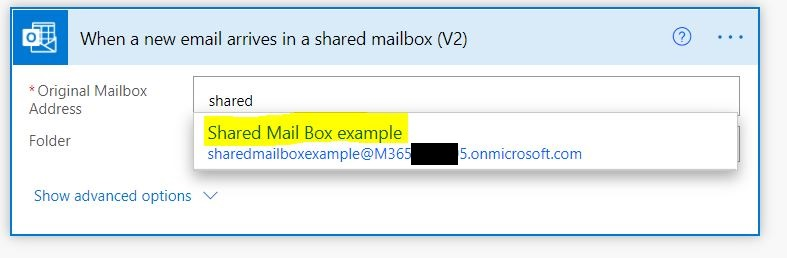

Content Organizer is a feature in SharePoint that allows the end-user to create rules that will help the team automatically organize their files based on the conditions/rules that were created.

Since in SharePoint Online the “Incoming Email” feature that we enjoy in SharePoint 2016, 2013, 2010 is no longer available. This guide will show you how to recreate that feature through the use of Power Automate in SharePoint Online.

## Create shared mailbox

First, we will a shared mailbox in M365/O365 that we can use in our PowerAutomate later

- Let go to our Admin Center

- Go to Groups > 'Shared mailboxes' page > 'Add a shared mailbox'


- Fill in the Name of the Shared mailbox and then the email address you like. Then Hit 'Save Changes'


## Enabling of 'Content Organizer' in our Site Collection.

- Let's now go to our Site Collection and we will need to enable the Content Organizer Feature

- Site settings > Manage site features > Content Organizer > Activate


_Note: that you might encounter this error when enabling_

**"The Site scoped feature being activated has a dependency on hidden Site Collection scoped feature 'FeatureDefinition/15/0c8a9a47-22a9-4798-82f1-00e62a96006e' (ID: '0c8a9a47-22a9-4798-82f1-00e62a96006e'). Hidden features cannot be auto-activated across scopes. There may be one or more visible Site Collection scoped features that auto-activate the dependent hidden feature."**

To fix this error you will need to enable first "SharePoint Server Standard Site Collection features" and "SharePoint Server Enterprise Site Collection features" first. Both can be found in the "Site Collection Features" in the "Site Settings"

- Once the Content Organizer is activiated, it will create a "Drop Off Library"


- It will also add two new options under the Site Settings > Site Administration


- Now we will add a new rule that will be use to sort our Emails we can do that by going Site Settings > Content Organizer Rules then press "New"

- Fill the necessary infomration with the following information


## Creating Power Automate that uses Content Organizer rules

- Create a new Automated cloud flow using the "Office 365 Outlook" that triggers when a new email arrives in a shared mailbox


- Enter in the shared mailbox we created earlier in the "Original Mailbox Address"



- After the trigger, we will add an action "Send an HTTP request to SharePoint". This will take care of retrieving our rules that we created in the "Content Organizer" the using it to sort out an email. Kindly fill up the following information

Site Address: Try to find your site collection here
Method : Get
Uri : \_api/Web/Lists/GetByTitle('Content Organizer Rules')/items?$select=Title,RoutingConditions,RoutingTargetPath,RoutingPriority&$orderby=RoutingPriority desc&\$RoutingEnabled eq true
Headers: "Accept" "application/json;odata=nometadata"


- After the "Send an HTTP request to SharePoint" action we will now use a "Parse Json" action:

- Content: body
- Schema:

```json {numberLines}
{
  "type": "object",
  "properties": {
    "value": {
      "type": "array",
      "items": {
        "type": "object",
        "properties": {
          "Title": {
            "type": "string"
          },
          "RoutingPriority": {
            "type": "string"
          },
          "RoutingConditions": {
            "type": "string"
          },
          "RoutingTargetPath": {
            "type": "string"
          }
        },
        "required": ["Title", "RoutingPriority", "RoutingConditions", "RoutingTargetPath"]
      }
    }
  }
}
```


- After that we will use the a loop to loop inside the value and loop to each rules

- After looping we will now it to get the Routing condition to upload the whole email in SharePoint. To export we can use the "Export Email (V2)" action then use the "Create File" action of SharePoint


- Now lets test it out by trying to send an email to the shared mailbox with the keyword we are looking for in the subject email


- After a couple of minutes it should upload our whole email to the "Toaster and Bread" in Sharepoint to the folder we specified in our Content Organizer rule.


