The demo shows how to utilize the Test automation feature of PowerApps to make sure that our Apps are working as expected.

First, let’s create a Blank Canvas App

Then name our App “Test Automate”

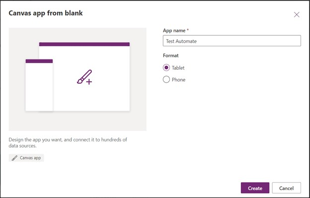

Once the App is built, we will insert two Text Input and two labels on our Canvas

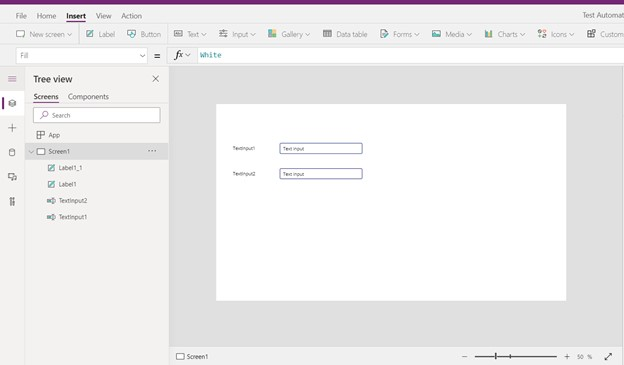

For each Text Input let's remove the Default valu

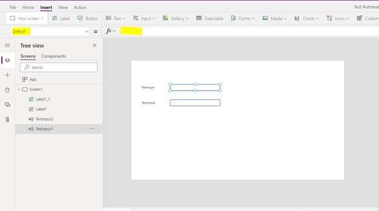

We will add another “Label” at the bottom and we will call it “LabelSum”, let's also get the sum of both TextInput1 and TextInput2 and we are going to display it on text( we also make the font bigger as well)

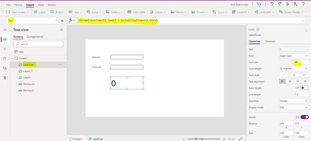

Let us now Save our change then open the Test Studio by click on Advanced Tools then click on “Open tests”

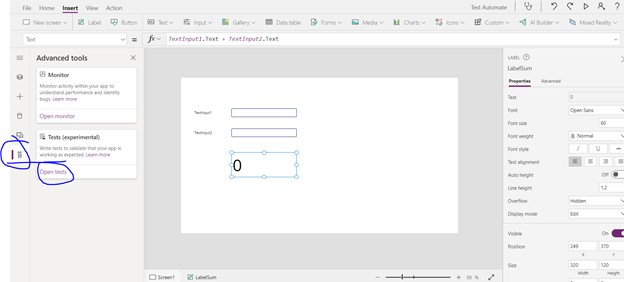

This will open the “Test Studio” in a new tab.

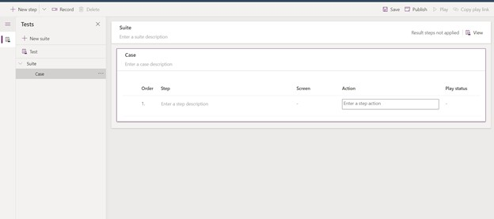

Lets now record and try writing Test Cases by click on the Record button

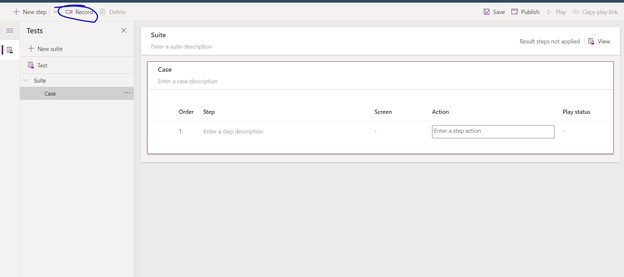

Try adding a value in “TextInput1” and also “Textinput2”, you will notice that it records on the left that each step that we did. Click on “Done”

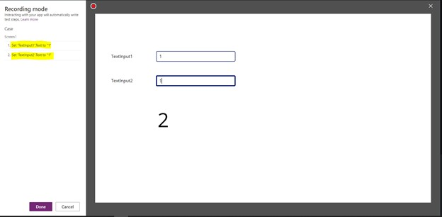

You will redirect to the “Test Studio” with the Test Case that is filled up through our record.

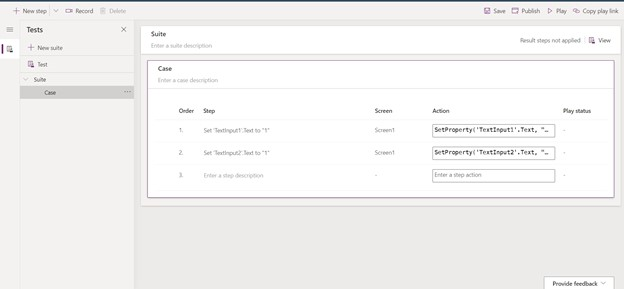

We will now add a new step called “Assert” Assert checks and validates if a given condition returns true. We can do that by click on the last step of our test case then clicking on “Insert step below” then selecting “Assert”

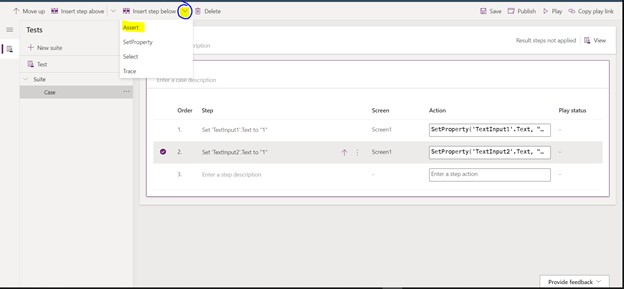

It should add a new step for Assert

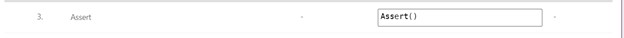

Assert can accept 2 arguments. The First Arguments is the condition that we wanted to check and the Second Arguments accepts a string that will be displayed if the first Arguments is not true

We will now Publish our changes and click on the "Play" button

Since the condition we set in our set returns true, our error message didn’t show up. Now let us change the value and make sure the assert will encounter an error

Now Assert encountered an error because we are trying to find the text “3” to our LabelSum

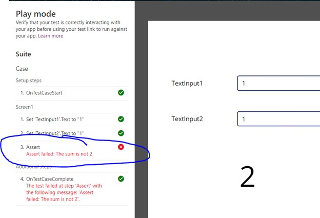

This is a pretty awesome feature to make sure that the app we built is working perfectly through testing. Note that this feature is still on the "Experimental" stage, so I don't suggest using it on your production projects
